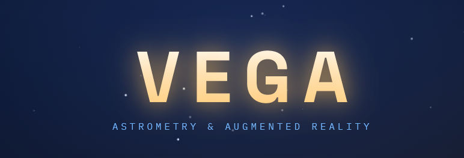

  

# VEGA

**A browser-based augmented-reality star map. Point your phone at the sky and Vega overlays stars, planets, and constellations onto your live camera feed, calculated in real time from your location and the current moment.**

🔭 **[Open the live app →](https://miro28.github.io/Vega/)**

No install, no telescope. Just open it on your phone, point it up, and explore the sky.

---

## What it does

- **Live AR sky overlay** - hold your phone up and the real positions of stars, planets, the Sun, and the Moon are drawn over your camera view, tracking as you move.
- **Identify anything** - point the reticle at a star, planet, or constellation and tap *Identify*; Vega names it and highlights the full constellation.
- **Naked-eye planets, colour-coded** - Mercury, Venus, Mars, Jupiter, and Saturn are drawn at their true brightness as points (just as the eye sees them), tinted by colour so you can tell a planet from a star at a glance.
- **Travel through time** - a time slider lets you scrub the sky days into the past or future to see where the planets, Sun, and Moon will be, then snap back to *Now* for the live sky.
- **Toggle the view** - turn the constellation lines or the camera feed on and off; with the camera off you get a clean planetarium-style sky on a dark background.
- **Real positions, real time** - every object is computed for your exact latitude/longitude and the current instant, not a generic preset sky.
- **Works anywhere** - uses your device location, so the sky is correct whether you're in Bulgaria or anywhere else on Earth.

## How it works

Vega computes where every celestial object sits in *your* sky using the [Astronomy Engine](https://github.com/cosinekitty/astronomy) library, converting each object's catalog coordinates into an altitude/azimuth for your position and time. Those positions are rendered on a sphere around the viewer with [Three.js](https://threejs.org/).

For the augmented-reality view, Vega reads the phone's orientation sensors (compass, accelerometer, gyroscope) through the browser's Device Orientation API and builds a rotation that aims the virtual camera wherever the phone points - so the rendered sky stays locked to the real sky as you move. The live camera feed sits behind the overlay, and a manual *Sync* control corrects for compass drift by aligning on a known object.

Planets are positioned and brightness-rated with Astronomy Engine and rendered through the same point system as the stars, so a planet appears at the same size as a star of equal magnitude - a faithful naked-eye view, distinguished only by colour. The time slider simply feeds an offset clock into the same position calculations, so scrubbing forward or back recomputes the entire sky for that moment.

The star field is drawn from a trimmed [HYG catalogue](https://www.astronexus.com/hyg) (naked-eye stars), and constellation figures come from the [d3-celestial](https://github.com/ofrohn/d3-celestial) line data.

## Built with

- **Three.js** - 3D rendering of the star field, constellation lines, and bodies
- **Astronomy Engine** - precise celestial position and magnitude calculations
- **Device Orientation, Geolocation & Camera APIs** - native browser sensors, no plugins
- **Plain JavaScript + GitHub Pages** - no build step, no backend

## Running it yourself

It's a static site. Clone the repo and open `index.html` through any HTTPS host (the orientation and camera sensors require a secure context). The live version runs on GitHub Pages. Best used on a phone, held in portrait.

## About

Vega is a personal project exploring the intersection of software and astronomy, built alongside my interest in aerospace engineering. It pairs real astronomical computation with browser-native AR to turn any phone into a window on the sky.